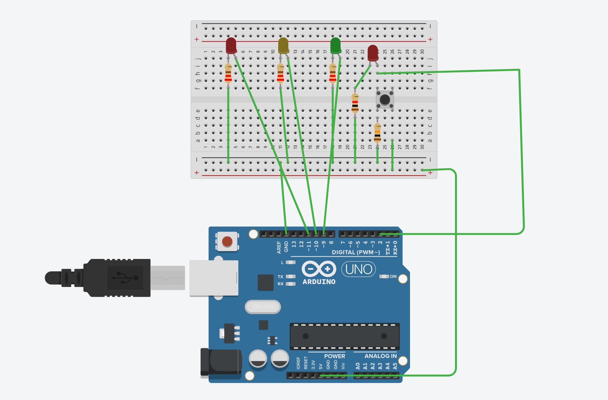
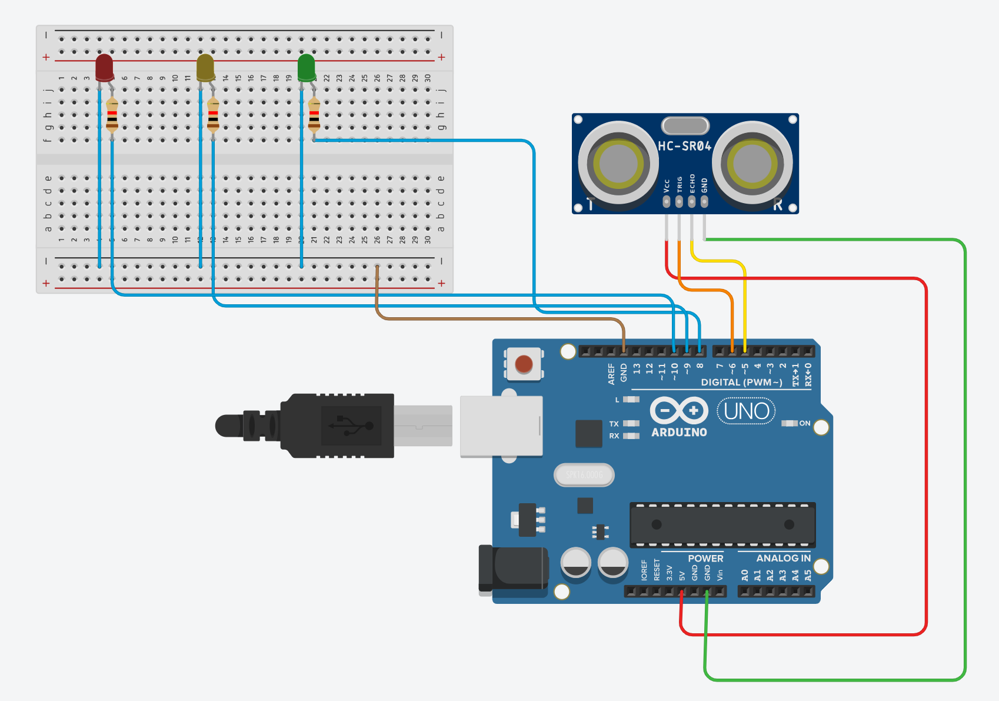

# Task: 1 | Basic Traffic Light System

## Description
A simple Arduino-based traffic light control system with manual override functionality. The system simulates a traffic light sequence and includes a pedestrian crossing button feature.

### [Tinker CAD Link](https://www.tinkercad.com/things/fxU5EFkFFWN-basic-traffic-light)



## Components Required
- Arduino board
- 3 LEDs (Red, Yellow, Green)
- 1 Push button
- Resistors (220Ω for LEDs, 10kΩ for button)
- Jumper wires
- Breadboard

## Pin Configuration
- Pin 9: Green LED
- Pin 10: Yellow LED
- Pin 11: Red LED
- Pin 2: Push Button Input

## Functionality
### Normal Mode
When no button is pressed, the traffic light follows this sequence:
1. Green light (2 seconds)
2. Yellow light (2 seconds)
3. Red light (2 seconds)

### Pedestrian Mode
When the button is pressed:
- The system immediately switches to Red light
- Red light stays ON for 7 seconds
- Returns to normal sequence

## Code
```
void setup() {
    pinMode(9, OUTPUT);
    pinMode(10, OUTPUT);
    pinMode(11, OUTPUT);
    pinMode(2, INPUT);
}

void loop() {
    if (digitalRead(2) == HIGH) {
        digitalWrite(11, HIGH);
        delay(7000);
        digitalWrite(11, LOW);
    } else {
        digitalWrite(9, HIGH);
        delay(2000);
        digitalWrite(9, LOW);
        
        digitalWrite(10, HIGH);
        delay(2000);
        digitalWrite(10, LOW);
        
        digitalWrite(11, HIGH);
        delay(2000);
        digitalWrite(11, LOW);
    }
}
```

# Task: 2 | Sensor Based Traffic Light System

## Description
A Sensor and Arduino-based traffic light control system with manual override functionality. The system simulates a traffic light sequence and includes a pedestrian crossing button feature.

### [Tinker CAD Link](https://www.tinkercad.com/things/fQI3OyBWGns-sensor-based-traffic-light-system)



## Components Required
- Arduino board
- 3 LEDs (Red, Yellow, Green)
- HC-SR04 Ultrasonic Sensor
- Resistors (220Ω for LEDs)
- Jumper wires
- Breadboard

## Pin Configuration
- Pin 8: Green LED
- Pin 9: Yellow LED
- Pin 10: Red LED
- Pin 5: ECHO Pin of HC-SR04
- Pin 6: TRIG Pin of HC-SR04

## Operating Logic

- Distance ≤ 100cm: Green light ON
- 100cm < Distance ≤ 200cm: Yellow light ON
- Distance > 200cm: Red light ON

## Code
```
int var = 0;

long readUltrasonicDistance(int triggerPin, int echoPin)
{
  pinMode(triggerPin, OUTPUT);  // Clear the trigger
  digitalWrite(triggerPin, LOW);
  delayMicroseconds(2);
  // Sets the trigger pin to HIGH state for 10 microseconds
  digitalWrite(triggerPin, HIGH);
  delayMicroseconds(10);
  digitalWrite(triggerPin, LOW);
  pinMode(echoPin, INPUT);
  // Reads the echo pin, and returns the sound wave travel time in microseconds
  return pulseIn(echoPin, HIGH);
}

void setup()
{
  Serial.begin(9600);
  pinMode(8, OUTPUT);
  pinMode(9, OUTPUT);
  pinMode(10, OUTPUT);
}

void loop()
{
  var = 0.01723 * readUltrasonicDistance(6, 5);
  Serial.println(var);
  if (var <= 100) {
    digitalWrite(8, HIGH);
  } else {
    digitalWrite(8, LOW);
  }
  if (var > 100) {
    if (var <= 200) {
      digitalWrite(9, HIGH);
    } else {
      digitalWrite(9, LOW);
    }
  } else {
    digitalWrite(9, LOW);
  }
  if (var > 200) {
    digitalWrite(10, HIGH);
  } else {
    digitalWrite(10, LOW);
  }
  delay(10); // Delay a little bit to improve simulation performance
}
```
